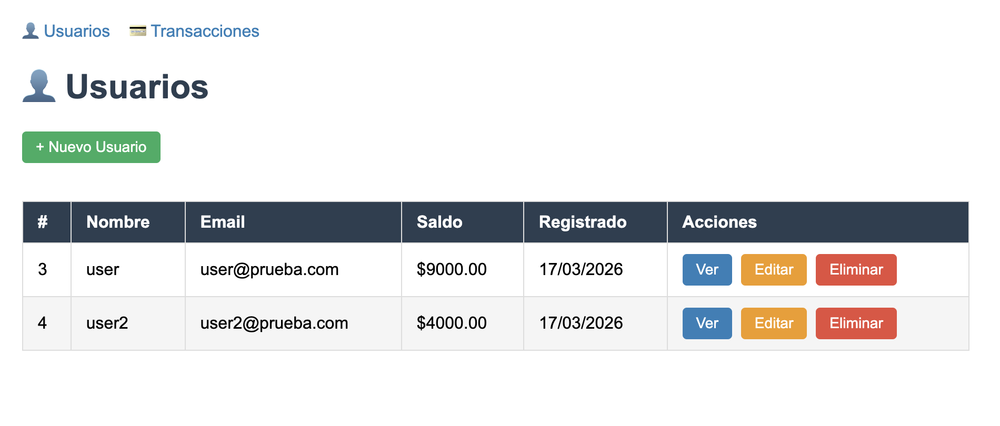
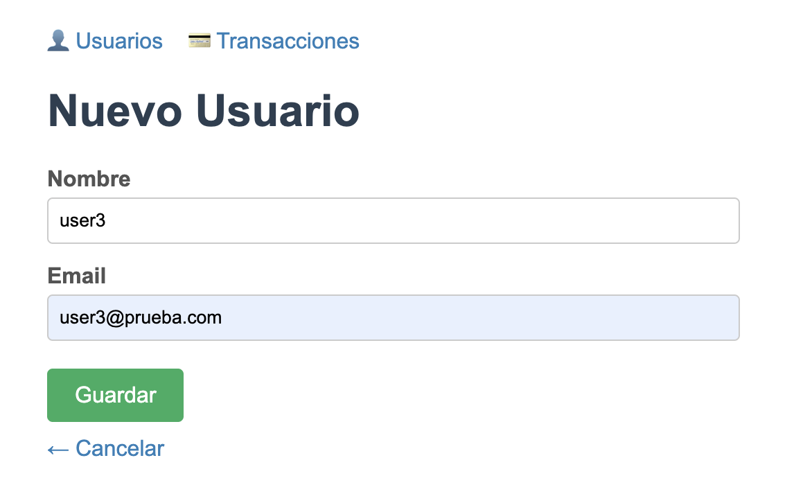
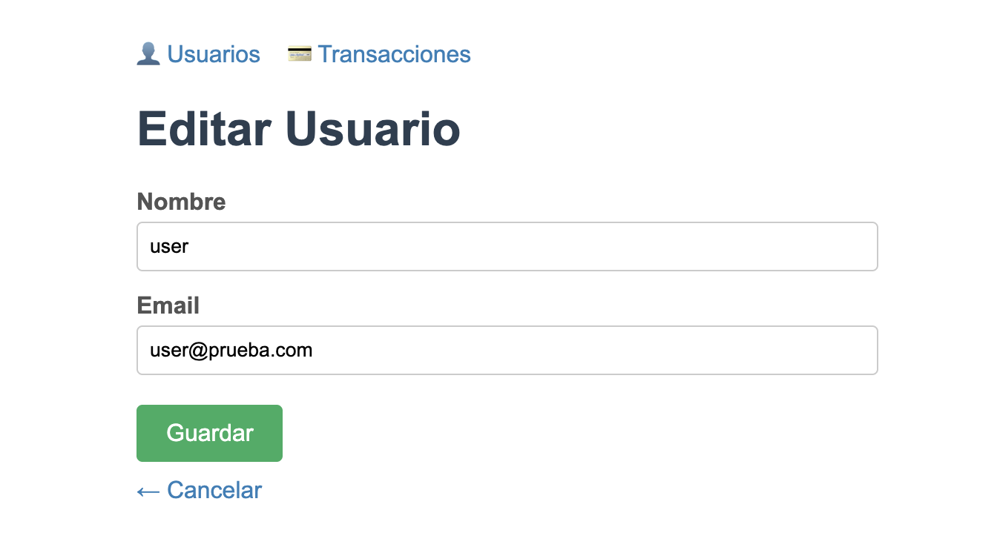
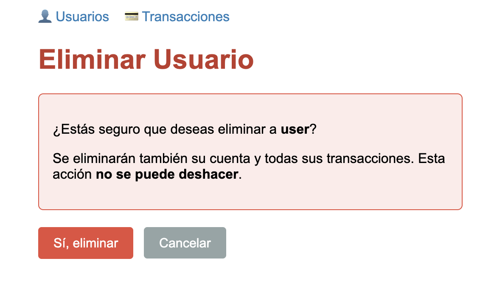
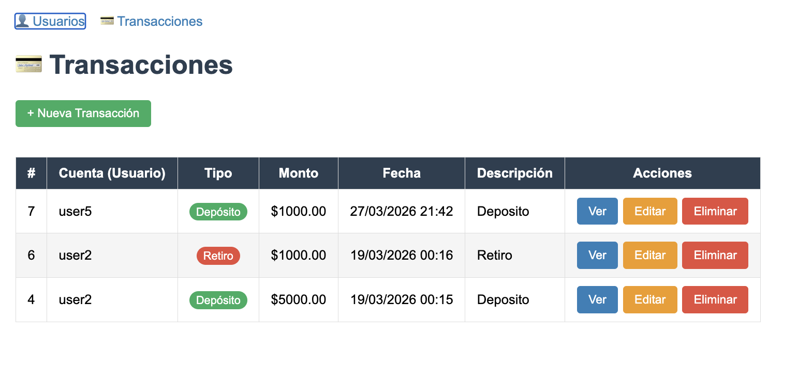

# Documento Explicativo — Alke Wallet

## 1. Modelo de Datos

Se crearon tres modelos:

- **Usuario**: `nombre`, `email` (único), `creado_en`. Representa a la persona registrada.
- **Cuenta**: `saldo`, `activa`. Ligada a un Usuario con relación **1 a 1** (`OneToOneField`). Se crea automáticamente al registrar un usuario.
- **Transaccion**: `tipo` (depósito/retiro), `monto`, `fecha`, `descripcion`. Ligada a una Cuenta con relación **1 a N** (`ForeignKey`).

Eliminar un Usuario borra en cascada su Cuenta y todas sus Transacciones.

---

## 2. Operaciones CRUD Implementadas

Se implementó CRUD completo desde el navegador para **Usuario** y **Transaccion**:

- **Crear**: Formulario para agregar un nuevo registro. Al crear un Usuario, se genera su Cuenta automáticamente con saldo 0.
- **Leer**: Lista general de registros y vista de detalle individual. El detalle de usuario muestra su cuenta y el historial de transacciones.
- **Actualizar**: Formulario prellenado con los datos actuales para editarlos.
- **Eliminar**: Pantalla de confirmación antes de borrar. Al eliminar una transacción, el saldo de la cuenta se recalcula automáticamente.

---

## 3. Capturas de Pantalla

### Lista de Usuarios

### Crear Usuario

### Editar Usuario

### Eliminar Usuario

### Lista de Transacciones

